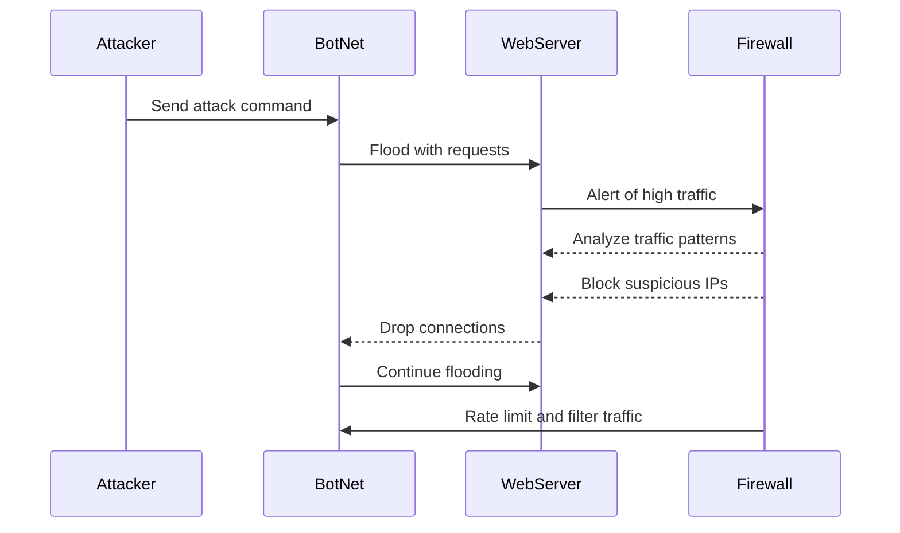

# DDoS Attack Sequence Diagram

## Attack begins
The attacker sends a signal to a BotNet that they control, activating the BotNet which begins to flood the WebServer with various requests in an attempt to overload and throttle the connection.

## Defense response
The Web Server quickly alerts the Firewall of the high amount of traffic and reports it as suspicious activity. The Firewall then begins to analyze the traffic patterns to identify whether this is an attack or real traffic, upon identifying the attack its begins to block suspicious IPs. Once an IP has been blocked the Web server begins to drop connections with those IPs.

## Attack continues
Despite IPs constantly being blocked, the BotNet is extensive and continues to flood the Web server with extreme amounts of traffic.

## Defense continues
Responding to the continued attack, the Firewall begins to rate limit and filter all incoming traffic, throttling both the bot attack but also regular users.